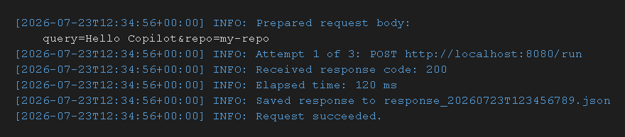

# GitHub MCP Agent (Java)

This repository is a Java (Spring Boot) application. It provides a simple web UI to collect API keys, repository, and query text, and launches the official GitHub MCP Docker server to capture output.


Important notes:
- This Java app currently starts the MCP Docker container, uses the OpenAI API to interpret queries, and captures the container stdout/stderr.
- It does not yet implement the full MCP agent orchestration from the original Python version.
- Docker must be installed and available on the machine where you run this app.

📘 Overview
This project provides a Java client (LocalServerClient.java) that communicates with a locally running MCP Agent server at http://localhost:8080/run.
It supports CLI arguments, retries, logging, and response persistence.

🚀 Command Line Usage
To execute the client, run:

bash
java -cp target/LocalServerClient-1.0-SNAPSHOT.jar LocalServerClient \
  --query "Hello Copilot" \
  --repo "my-repo" \
  --retries 3 \
  --backoff-ms 500
Options
--query → The query text to send to the server (required)

--repo → The repository name to include in the request (optional)

--retries → Number of retry attempts if the request fails (default: 3)

--backoff-ms → Backoff time in milliseconds between retries (default: 500)


✨ Features
CLI support for --query, --repo, --retries, and --backoff-ms

Configurable retry limit and backoff delay

Timestamped INFO/WARN/ERROR logging

Elapsed time logging per request attempt

Response persistence to response_<timestamp>.json


Summary log appending to client.log

Formatted request/response logging
Build and run

1. Set required environment variables (either export or provide in the form):

```powershell
setx OPENAI_API_KEY "your-openai-key"
setx GITHUB_TOKEN "your-github-token"
```

2. Build the project with Maven:

```bash
mvn package
```

3. Run the application:

```bash
java -jar target/github-mcp-agent-java-0.1.0.jar
```

4. Open http://localhost:8080 in your browser.

Local client helper
- The project includes `LocalServerClient.java`, which can send a local POST request to `http://localhost:8080/run` with retry and backoff support.
- It logs INFO, WARN, and ERROR levels, saves responses to `response_<timestamp>.json`, and appends a short summary to `client.log`.

Example command line
```powershell
mvn -q -DskipTests compile exec:java -Dexec.mainClass=com.example.githubmcpagent.service.LocalServerClient -Dexec.args="--query \"Hello Copilot\" --repo \"my-repo\" --retries 3 --backoff-ms 500"
```


Sample output



Extending to full AI agent
- To recreate the Python agent behavior, integrate an OpenAI Java client and implement logic to talk to the MCP server (the container exposes the MCP endpoints). The Python project used `agno` and `MCPTools` to orchestrate agent runs; the Java implementation would require equivalent code to call the MCP server APIs and to run LLM requests.

Docker

You can build a Docker image for this app:

```bash
mvn package -DskipTests
docker build -t github-mcp-agent-java:latest .
```

Tests

Run unit tests with:

```bash
mvn test
```

